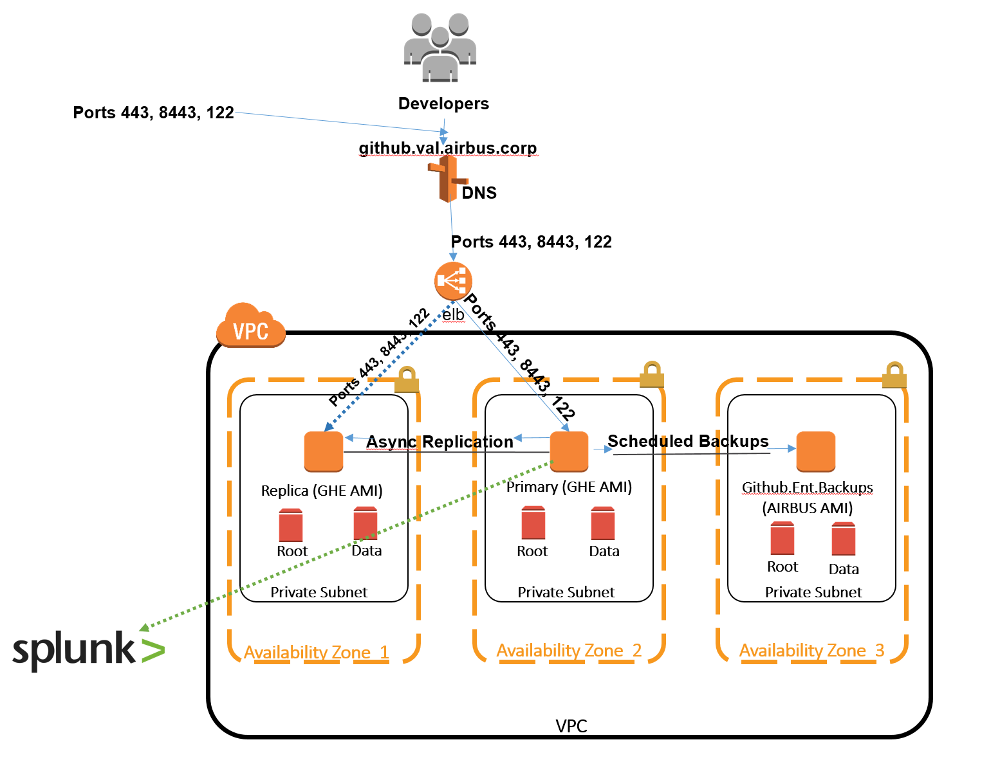
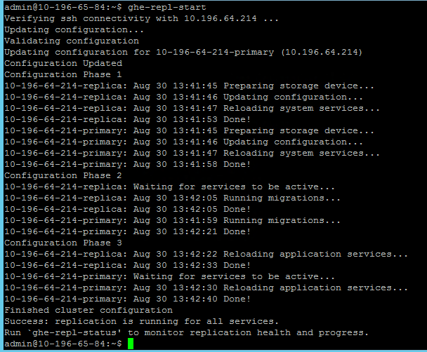
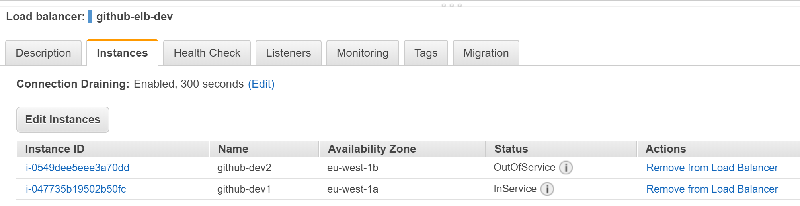
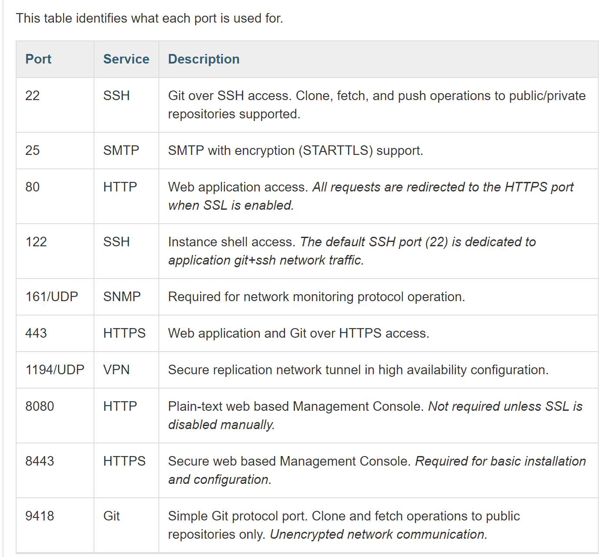

# Github Enterprise 
  ## Design:
  

## Overview
This ansible playbook deploys and configures a load balancer and 2 ec2 instances of GitHub Enterprise into the Amazon Web Services (AWS) cloud using Githubs provided AMI. A third ec2 instance is created for DB level backups using the hardened RHEL AMI. Cron job is setup on the Backup instance to sync the snapshots to AWS S3. 

## Prereqs:
    * A fully configured Jenkins node
    * Jenkins configured to Build with parameters ie dev, val, prod
    * IAM Role with permission to create ec2 and s3 services
    * EC2 keypair
    * Github license file  
    * ssl certifcate and private key for dev, val and prod
    * populate prod.yml with environment specifics ( see comments in that file )
    * to run the playbook without jenkins then you will need to install: 
        *pip
        *pip3
        *python2
        *boto
        *boto3
        *ansible 
        *expect
        *configparser colorama awscurl platform-auth-cli.zip
        *.vault file with vault password
      To run the playbook: ansible-playbook -i inventory/ec2.py site.yml -e "env_name=$ENV" --private-key=yourpemkey.pem --vault-password-file .vault

      
  ## Infra Setup
   Jenkins will provide a drop down menu to build dev, prod or val. The repo will create:  
   * AWS Elastic Load Balancer (ELB) in eu-west-1
      * new security group for load balancer (listening on port 8443, 122 and 443). 
      * utilizing all 3 zones for HA. 
      * using all 3 private subnets.
      * using variable file called lan-ips containing all company internal ips. 
      * using variable files prod.yml, val.yml and dev.yml containg env variables.
      * the .corp dns will be updated with the cname of the newly created load balancer.
      
    * AWS Elastic Compute node (EC2) in eu-west-1
      * 3 ec2 instance's will be created. 1 as primary node and the other as a replica node for 
        Active/Passive configuration. The 3rd node will be used for Database level backups. 
      * new security group for ec2 (allowing inbound traffic from the load balancer)
      * using Github provided AMI (root drive unencrypted, data drive encrypted)
      * using company hardened AMI (both drives encrypted) 
      * using private subnets 
      * using roles.
      * The primary and replica nodes will be added to the load balancer.
      * The management console password and github license file will be uploaded during the build
        using github's api  

  ## Replication Setup
    This is a manual process (GITHUB DO NOT RECOMMEND SCRIPTING THIS PROCESS)
       * ssh on port 122 onto the 2nd node:
          *chmod 400 prodpemkey.pem
          *ssh -i prodpemkey.pem -p 122 admin@node2_ip
       * from the 2nd node, run github commands to setup replication
          * run: ghe-repl-setup ipaddress_of_node1
          * visit http://node1_ip/setup/settings and authorise the displayed SSH Key
          * run: ghe-repl-setup ipaddress_of_node1
          * run: ghe-repl-start
    ### results of ghe-repl-start command:
  
  
  
        2nd node will show out of service whiles in replication mode.

        Any connectivity issues here, check security groups and make sure required TCP and UDP ports are opened:
        
    
  ## Backup
    

 further reading: https://help.github.com/enterprise/2.14/admin/guides/installation/installing-github-enterprise-on-aws/ 

